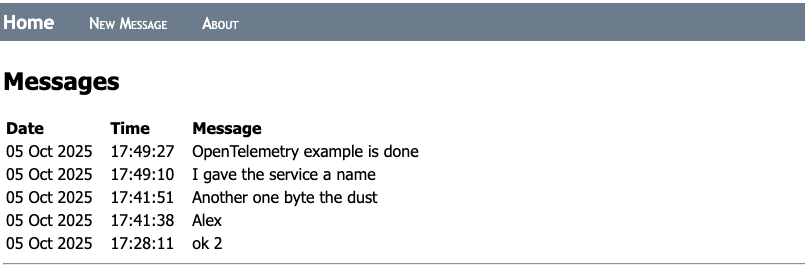
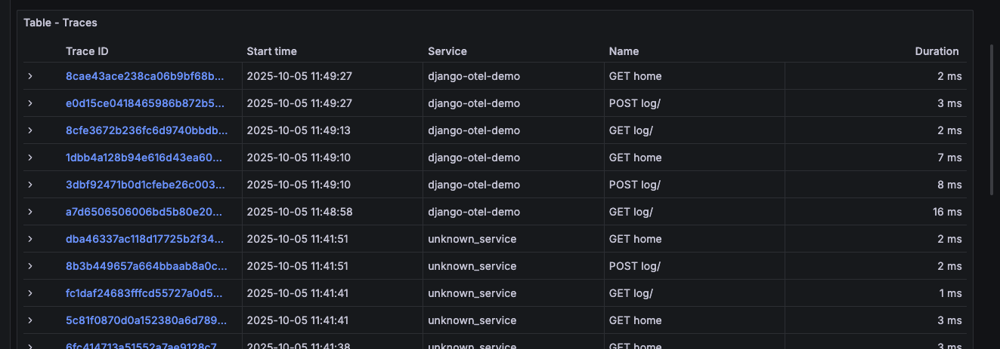

# Django Template

This sample repo contains the recommended structure for a Python Django project. In this sample, we use `django` to build a web application and the `unittest` to run tests.

For a more in-depth tutorial, see our [Django tutorial](https://code.visualstudio.com/docs/datascience/data-science-tutorial).

The code in this repo aims to follow Python style guidelines as outlined in [PEP 8](https://peps.python.org/pep-0008/).

## Running the Sample

To successfully run this example, we recommend the following VS Code extensions:
- [Python](https://marketplace.visualstudio.com/items?itemName=ms-python.python)
- [Python Debugger](https://marketplace.visualstudio.com/items?itemName=ms-python.debugpy)
- [Pylance](https://marketplace.visualstudio.com/items?itemName=ms-python.vscode-pylance) 

- Open the template folder in VS Code (**File** > **Open Folder...**)
- Create a Python virtual environment using the **Python: Create Environment** command found in the Command Palette (**View > Command Palette**). Ensure you install dependencies found in the `pyproject.toml` file
- Ensure your newly created environment is selected using the **Python: Select Interpreter** command found in the Command Palette
- Create and initialize the database by running `python manage.py migrate` in an activated terminal. 
- Run the app using the Run and Debug view or by pressing `F5`
- Run tests by running `python manage.py test` in an activated terminal

# Author
Alejandro Mercado

# Project Structure

- **.gitignore**: Specifies files and folders to be ignored by Git version control.
- **manage.py**: Django’s command-line utility for administrative tasks and OpenTelemetry instrumentation.
- **pyproject.toml**: Project metadata and configuration, including dependencies.
- **requirements.txt**: Lists Python packages required for the project.
- **tempo.yaml**: Configuration file for Grafana Tempo trace backend.
- **README.md**: Project documentation and instructions.
- **.vscode/**: VS Code editor configuration files.
  - **launch.json**: Debugging configuration for VS Code.
  - **settings.json**: Workspace-specific settings for VS Code.
- **hello/**: Main Django app containing core functionality.
  - **__init__.py**: Marks the directory as a Python package.
  - **admin.py**: Configuration for Django admin interface.
  - **apps.py**: App-specific configuration.
  - **forms.py**: Web forms definitions for user input.
  - **models.py**: Database models (data structure).
  - **tests.py**: Unit tests for the app.
  - **urls.py**: URL routing for the app.
  - **views.py**: Request handling and business logic.
  - **migrations/**: Database schema migrations.
    - **__init__.py**: Marks migrations as a package.
    - **0001_initial.py**: Initial database migration.
  - **static/**: Static files (CSS, JS, images).
    - **hello/**: Static assets for the app.
      - **site.css**: Stylesheet for the app.
  - **templates/**: HTML templates for rendering views.
    - **hello/**: Templates specific to the app.
      - **about.html**: About page template.
      - **home.html**: Home page template.
      - **layout.html**: Base layout template.
      - **log_message.html**: Template for log messages.
- **web_django/**: Django project configuration.
  - **__init__.py**: Marks the directory as a Python package.
  - **asgi.py**: ASGI entry point for asynchronous servers.
  - **settings.py**: Project settings and configuration.
  - **urls.py**: URL routing for the entire project.
  - **wsgi.py**: WSGI entry point for web servers.